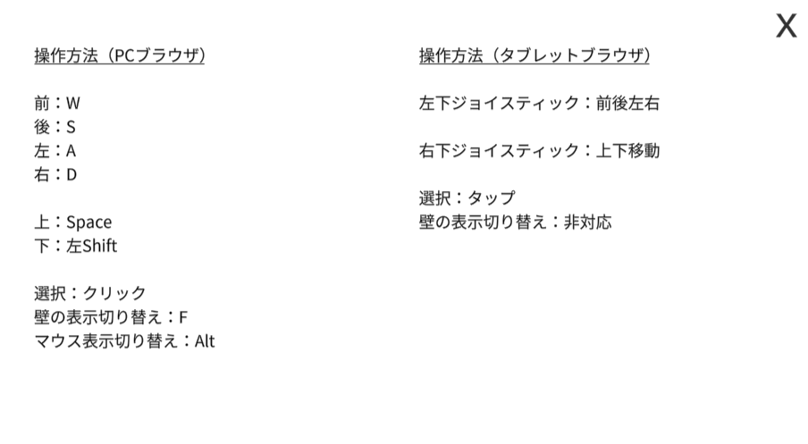

# 江戸川乱歩邸 3D（研究開発）

## 作品概要

研究室内での、現実世界のデジタルアーカイブを行うプロジェクトに関連して、3d スキャンした現実世界の建物をモデルとして利用し、建物に由来するクイズを 3d 空間内で楽しむゲームを作成しました。 
大衆的な利用を想定して WebGL 環境で作成し、インストール不要のタブレットブラウザでの動作もサポートできるよう、LOD を活用し負荷の調整を行いました。

## 成果

※動画のみとなります。

- デモ動画

<iframe src="https://drive.google.com/file/d/1k35wufTdoyisutr6vBGYYY8kVEbuPzid/preview" width="560" height="315" allow="autoplay"></iframe>

## 開発背景

歴史的建造物に関して、老朽化に伴う管理費の増加や焼失などを理由とする登録文化財の解体が生じています。 
立教大学が管理する、江戸川乱歩邸においても老朽化に伴う取り壊し等が検討されて初めている段階でした。 
そこで、歴史的建造物が持つデータ群のデジタルアーカイブを行い、オープン化を検討する取り組みを行いました。 
私は、江戸川乱歩邸の 3D スキャンとその活用方法を検討するという部分で関わりました。

## 操作方法

## 開発期間

2021 年 10 月～ 2022 年 2 月

## 開発環境

Unity（WebGL）

### 使用ライブラリ

- UniRx

<!-- ## 開発メンバーと担当範囲 -->

<!-- ## ポイント -->

<!-- ## 展望 -->
